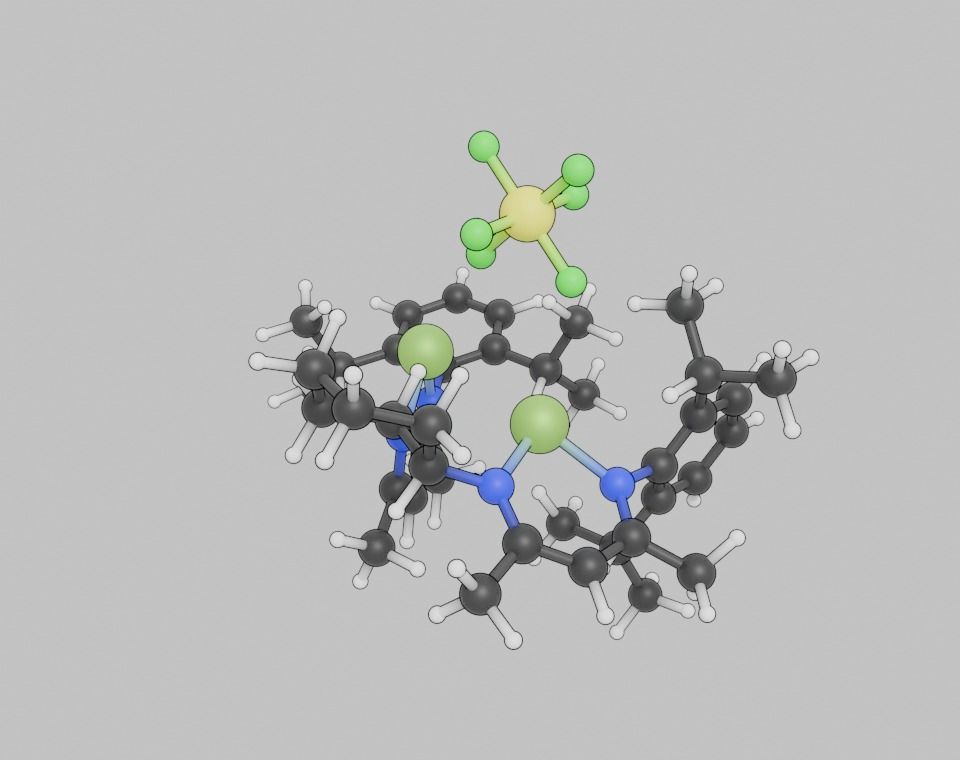
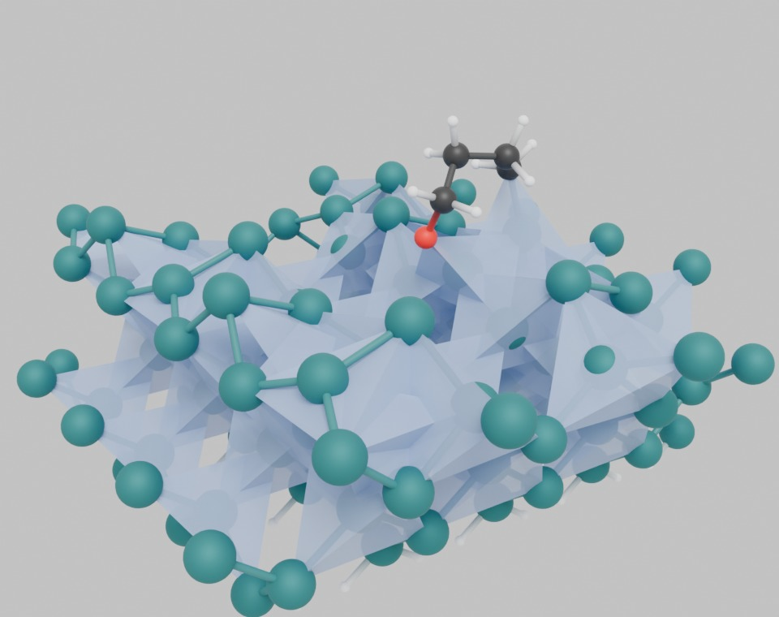
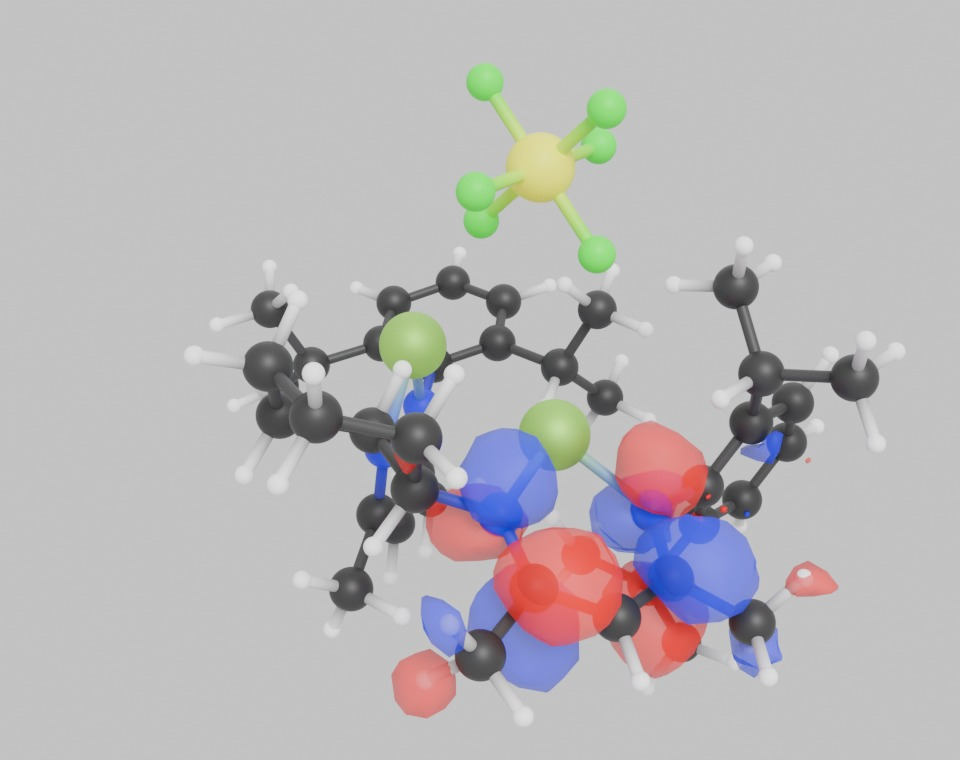
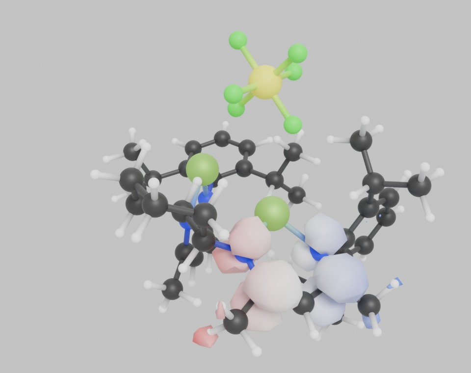

# Collection of Blender Addons for Molecular Structures

Import molecules, crystals, trajectories, and volumetric data (electron densities, molecular orbitals) into Blender through [ASE](https://gitlab.com/ase/ase) — with geometry-nodes representations, coordination polyhedra, and isosurfaces.

<table>
  <tr>
    <td align="center" width="50%">
       
      <b>Molecules</b> — geometry-nodes atoms with gray or element-colored bonds
    </td>
    <td align="center" width="50%">
       
      <b>Coordination polyhedra</b> — convex hulls of coordination shells as solid faces
    </td>
  </tr>
  <tr>
    <td align="center" width="50%">
       
      <b>Molecular orbitals &amp; densities</b> — .cube / VASP volumes with node-based isosurfaces
    </td>
    <td align="center" width="50%">
       
      <b>Density as mesh</b> — marching-cubes isosurfaces, optionally colored by a second density file
    </td>
  </tr>
</table>

## Dependencies

Dependencies are automatically installed upon activation of the addon using `pip` if an internet connection is present.
In case no internet connection is available. [ASE](https://gitlab.com/ase/ase) needs to be installed manually.

### Manual dependency installation
* Use the blender scripting view to get the module directory: `bpy.utils.script_path_user() + "/modules"`
* Install ASE to the path using pip: `pip install ase --target <install_dir>
* Restart Blender
* 
## Installation

To use the addons in Blender simply download the zip file for yor version `blender_importASE.zip` from the latest release. In Blender go to edit -> preferences -> addons; click install; find the zip file and install it. Then activate the new addon in the list. If you want to use the automatic rendering of viewpoints, also download the file `render_vpts.py` and install and activate the same way.

### Developement Install

Symlink the `render_vpts.py` file and the `blender_importASE` folder into your addon directory (by default under linux `~/.config/blender/x.x/scripts/addons`).

## Usage

You can now import molecules from the File -> import tab and use render -> render vpts to render all collections seperately for your list of cameras.

Images will be put in the folder with the collection name and the name of the camera (name them top, side, front. camera.001 and camera.002 won't help you understand it).

### Electron densities

With "load e-density" enabled, volumetric data is imported as a Blender volume
with a node-based isosurface (adjustable isovalue and directional cutoffs):

* `.cube` files (Gaussian cube format)
* VASP files: `CHGCAR`, `CHG`, `PARCHG`, `AECCAR*`. For spin-polarized
  calculations a second volume with the spin difference is created, with green
  (spin-up excess) and pink (spin-down excess) isosurfaces.

Note that densities are shown in e/A^3 (ASE convention), so isovalues from
tools that use the raw CHGCAR values (e.g. VESTA) do not transfer directly.

### ASE panel

Imported structures get a panel in the 3D viewport sidebar (N key -> ASE tab)
with the most important settings in one place: per-element switching between
covalent and vdW radii, hiding bonds per element pair, bond distance/radius and
resolution, supercell repeats, outline thickness, per-element visibility, and
the isovalues of any imported densities.

### Materials

The materials used by the geometry-node representations are the ones in the
object's Material Properties tab (sorted by element, bond material last), so
you can swap or edit them there and the viewport/render follows.
