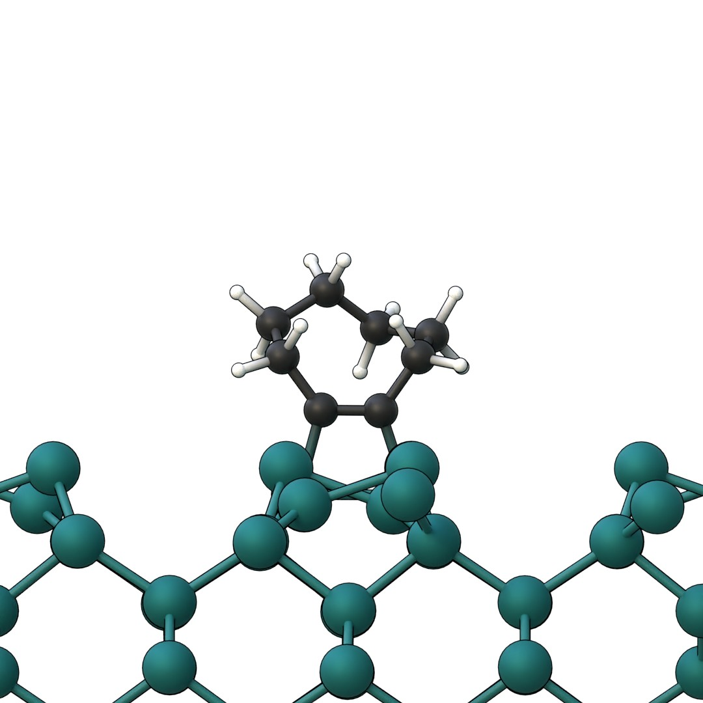
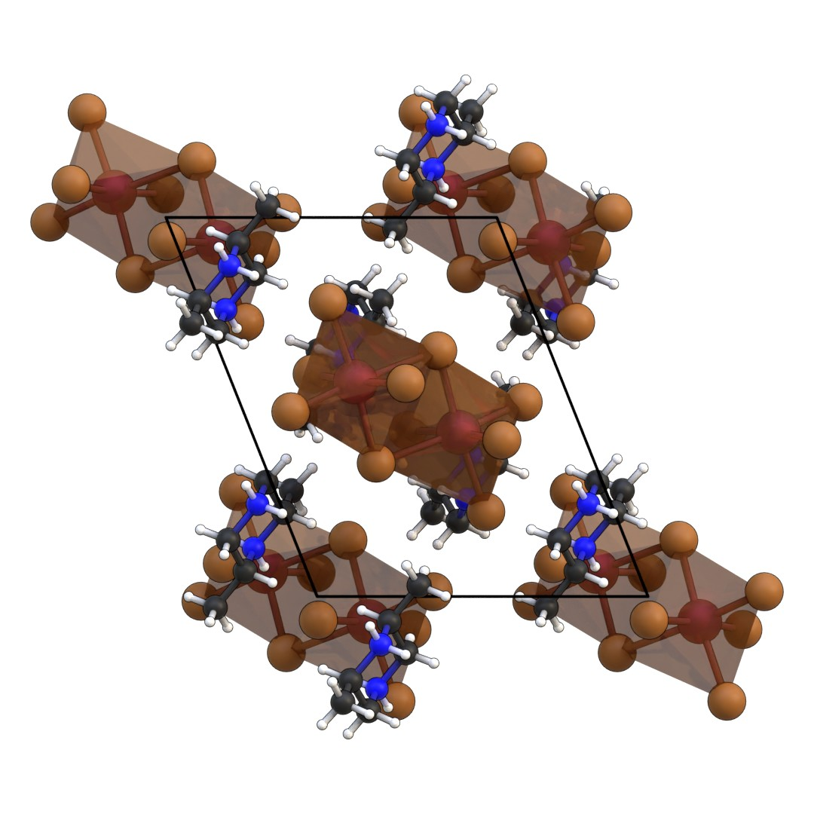
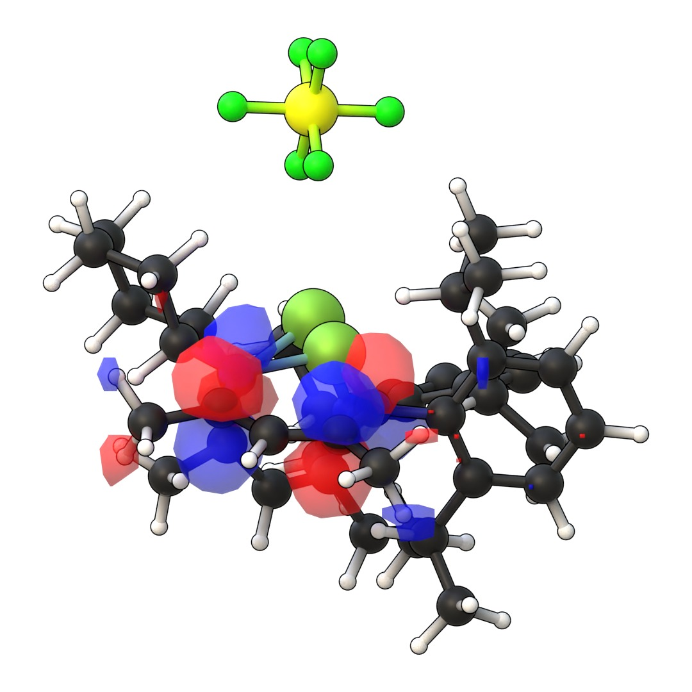
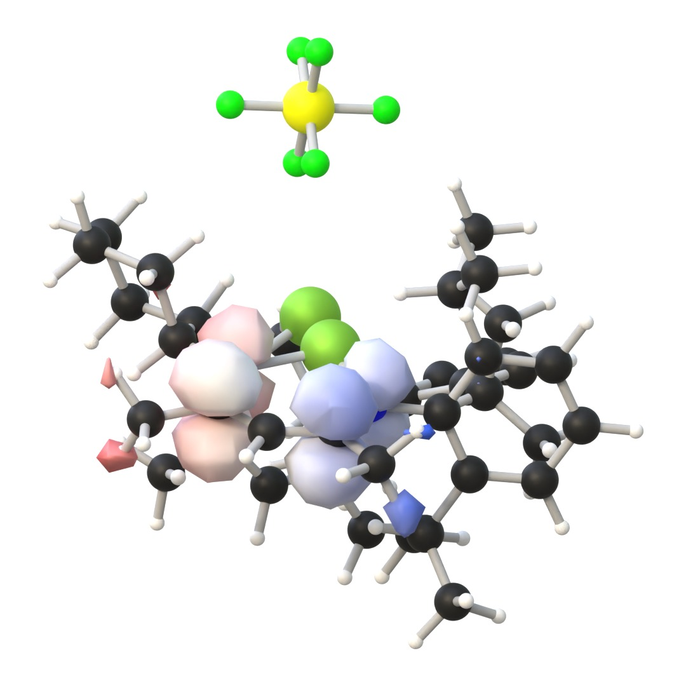
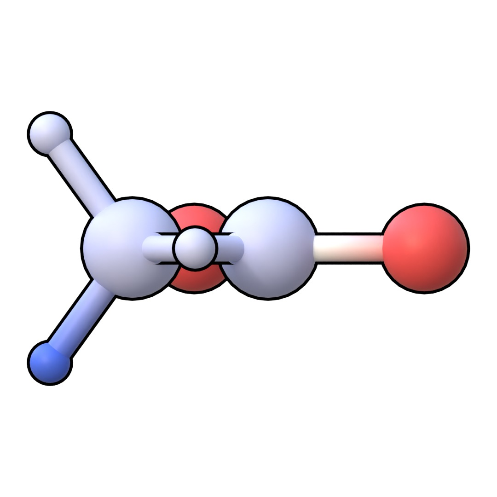
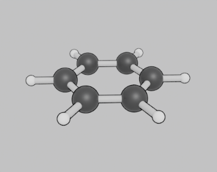
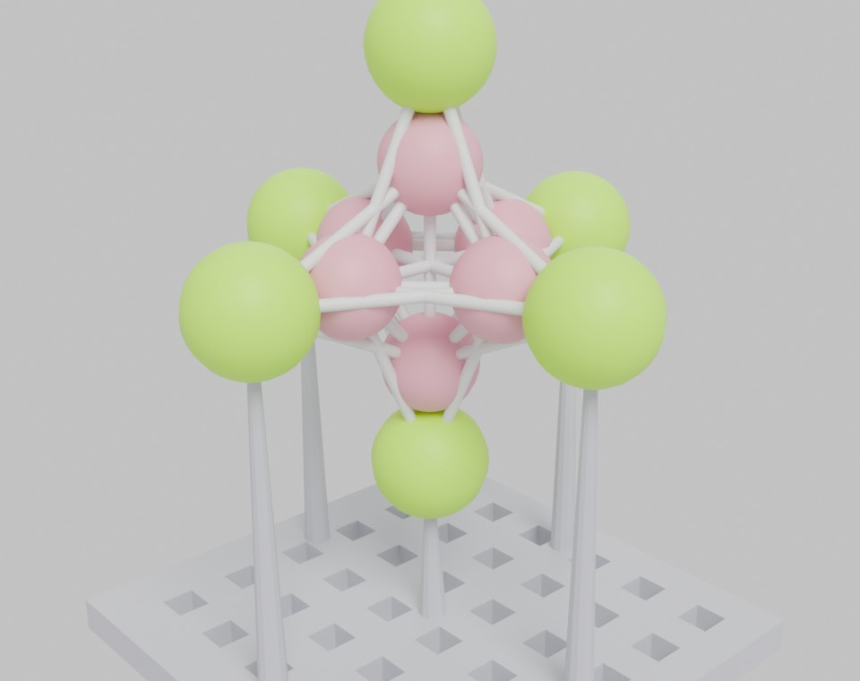

# Collection of examples

Import molecules, crystals, trajectories, and volumetric data (electron densities, molecular orbitals) into Blender through [ASE](https://gitlab.com/ase/ase) — with geometry-nodes representations, coordination polyhedra, and isosurfaces.

<table>
  <tr>
    <td align="center" width="50%">
       
      <b>Molecules</b> — geometry-nodes atoms with gray or element-colored bonds
    </td>
    <td align="center" width="50%">
       
      <b>Coordination polyhedra</b> — convex hulls of coordination shells as solid faces
    </td>
  </tr>
  <tr>
    <td align="center" width="50%">
       
      <b>Molecular orbitals &amp; densities</b> — .cube / VASP volumes with node-based isosurfaces
    </td>
    <td align="center" width="50%">
       
      <b>Density as mesh</b> — marching-cubes isosurfaces, optionally colored by a second density file
    </td>
  </tr>
  <tr>
    <td align="center" width="50%">
       
      <b>Partial charges</b> — per-atom charges from a csv file, red-white-blue on atoms and bonds
    </td>
    <td align="center" width="50%">
       
      <b>Trajectories</b> — any ASE-readable trajectory, animated frame by frame (including varying atom counts)
    </td>
  </tr>
  <tr>
    <td align="center" colspan="2">
       
      <b>3D printing</b> — atoms and bonds with generated resin supports, exported as per-element STLs in one zip
    </td>
  </tr>
</table>

## Dependencies

Dependencies are automatically installed upon activation of the addon using `pip` if an internet connection is present.
In case no internet connection is available. [ASE](https://gitlab.com/ase/ase) needs to be installed manually.

### Manual dependency installation
* Use the blender scripting view to get the module directory: `bpy.utils.script_path_user() + "/modules"`
* Install ASE to the path using pip: `pip install ase --target <install_dir>
* Restart Blender
* 
## Installation

Click the **Download Add-on** button above for `blender_importASE.zip` built straight from the current `main` (rebuilt automatically on every push - see `.github/workflows/build-latest.yml`). For a stable, versioned copy instead, grab it from a [tagged release](https://github.com/hweiske/blender-importASE/releases/latest) instead. Either way: in Blender go to edit -> preferences -> addons; click install; find the zip file and install it. Then activate the new addon in the list. Viewpoint rendering (render -> render vpts) is part of the addon, so there is nothing else to install.

### Developement Install

Symlink the `blender_importASE` folder into your addon directory (by default under linux `~/.config/blender/x.x/scripts/addons`).

## Usage

You can now import molecules from the File -> import tab and use render -> render vpts to render all collections seperately for your list of cameras.

Images will be put in the folder with the collection name and the name of the camera (name them top, side, front. camera.001 and camera.002 won't help you understand it).

### Electron densities

With "load e-density" enabled, volumetric data is imported as a Blender volume
with a node-based isosurface (adjustable isovalue and directional cutoffs):

* `.cube` files (Gaussian cube format)
* VASP files: `CHGCAR`, `CHG`, `PARCHG`, `AECCAR*`. For spin-polarized
  calculations a second volume with the spin difference is created, with green
  (spin-up excess) and pink (spin-down excess) isosurfaces.

Note that densities are shown in e/A^3 (ASE convention), so isovalues from
tools that use the raw CHGCAR values (e.g. VESTA) do not transfer directly.

### ASE panel

Imported structures get a panel in the 3D viewport sidebar (N key -> ASE tab)
with the most important settings in one place: per-element switching between
covalent and vdW radii, hiding bonds per element pair, bond distance/radius and
resolution, supercell repeats, outline thickness, per-element visibility, and
the isovalues of any imported densities.

### Custom bonds (dotted / scaled / dashed)

Select two atoms of an imported structure (edit mode, pick the two vertices)
and press "Add custom bond" in the ASE sidebar. The *bond type* dropdown in
the redo panel (F9) picks the style:

* **Dotted** - a row of spheres between the two atoms
* **Scaled** - a solid bond that gets thinner the longer it is, capped at the
  chosen radius. It is measured against the bond's natural length (the two
  atoms' covalent radii added), so a normal-length bond is full thickness and
  a stretched or partial one thins in proportion
* **Dashed** - alternating cylinder segments

Use them for partial bonds in a transition state, hydrogen bonds, or any
interaction the distance-based bond search does not draw. All three take the
bond colour (blended between the two atoms), match the structure's own bond
radius unless you set one, and get the outline. Each bond is listed in the ASE
panel of the structure, so the two atoms can be changed there afterwards. The bond
samples the atom positions live, so it follows the structure and its
trajectory.

"replace solid bond" additionally hides the normal bond between the two atoms,
so the custom one takes its place. Note this is one replacement per atom: if
you replace 0-1 and then 0-2, the 0-1 bond reappears. "Reset custom bonds"
brings every replaced solid bond back and deletes the custom bond objects
again.

### Materials

The materials used by the geometry-node representations are the ones in the
object's Material Properties tab (sorted by element, bond material last), so
you can swap or edit them there and the viewport/render follows.

### 3D printing

The "3D print" representation (formerly `bonds_fromnodes`) imports real
sphere meshes plus geometry-node bond tubes with icospheres at every atom
position ("joint radius" on the modifier), so bonds fuse into a printable
solid. File -> Export -> "ASE 3D print (.zip)" then writes one STL per
element (atoms joined), the bonds, and simple resin supports (base plate +
tapered pillars under the lowest atoms; skipped if the collection already
contains your own "supports" object) into a single zip for the slicer.

### Export to xyz

File -> Export -> "ASE xyz (.xyz)" writes the active nodes-representation
structure back to a plain xyz file, using the vertex positions (in world
coordinates, i.e. including any edits) and the stored element numbers.
